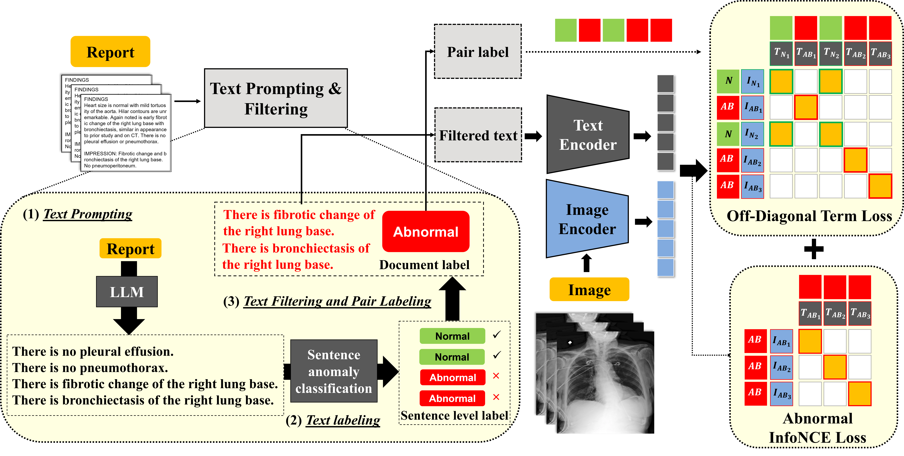

# OFF-CLIP: Improving Normal Detection Confidence in Radiology CLIP with Simple Off-Diagonal Term Auto-Adjustment

## About
OFF-CLIP (**OFF**-Diagonal Term Auto-Adjustment **C**ontrastive **L**anguage-**I**mage **P**re-Training) is a novel contrastive learning framework that refines medical image–text alignment. OFF-CLIP introduces an off-diagonal term loss to enhance normal clustering and a text filtering strategy to remove normal statements from abnormal reports, reducing both False positives and false negatives. These modifications improve normal detection and anomaly localization, outperforming the CARZero baseline in zero-shot classification.



## Datasets
OFF-CLIP is trained using the MIMIC-CXR dataset, which contains 377,110 chest radiographs paired with associated reports. Only frontal images are retained. If there are multiple frontal images, one is randomly selected. For reports with several prompted sentences, one is chosen per epoch. The training is restricted to images from the p10-16 folders within the p10-19 range.

For evaluation and ablation studies, the following datasets are used: VinDr-CXR (18,000 X-rays, 28 disease annotations with bounding boxes; 3,000 evaluation scans, 68.3% normal), Open-I (7,470 X-rays, 18 disease annotations), CheXpert (224,316 X-rays, 14 disease annotations; evaluated on 500 cases), and PadChest (160,868 X-rays, 192 disease annotations; evaluated on 39,053 manually labeled cases).

You can download each dataset using the following links: [MIMIC-CXR](https://physionet.org/content/mimic-cxr/2.0.0/), [VinDr-CXR](https://physionet.org/content/vindr-cxr/1.0.0/), [CheXpert](https://stanfordaimi.azurewebsites.net/datasets/23c56a0d-15de-405b-87c8-99c30138950c), [Open-I](https://openi.nlm.nih.gov/faq), [PadChest](http://bimcv.cipf.es/bimcv-projects/padchest/).

## How to start
```bash
pip install -r requirments.txt
```

## Train
The training loss code will be publicly released after the acceptance notification. 

For the text filtering, we utilized the trained abnomaly sentence-level classificatio model, and you can downloaded the model on this link: [Anomaly-Classification](https://drive.google.com/file/d/1QuRSJBnaj5Plj_XAxRE8XsyjESLyS9wb/view?usp=drive_link).

## Validation
### Weight checkpoints  
To test the validation, download the [OFF-CLIP checkpoint](https://drive.google.com/file/d/1JmfB2jbl-58aBrxRwaMrGjhPNUUjKNC-/view?usp=drive_link). This checkpoint provides the best performance and includes all proposed modifications (text filtering, off-diagonal term loss, and abnormal InfoNCE loss).

### Zero-shot classification for multi-label datasets
To run zero-shot classification on multi-label datasets, use the following command:
```bash
python3 validation.py --weight_path {weight path to load} --save_name {name to save similarities and results} -c configs/offclip.yaml
```


